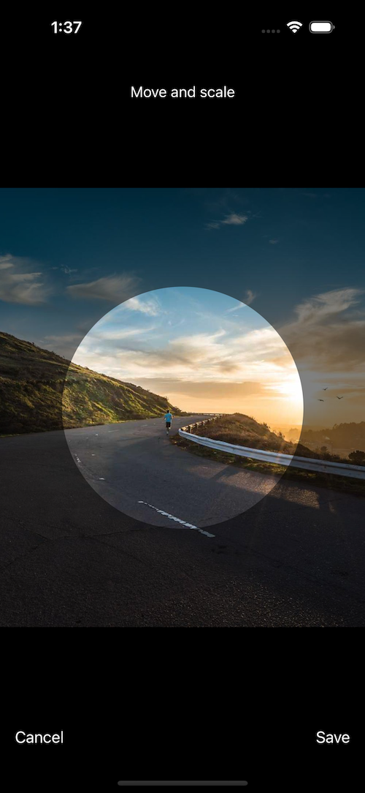
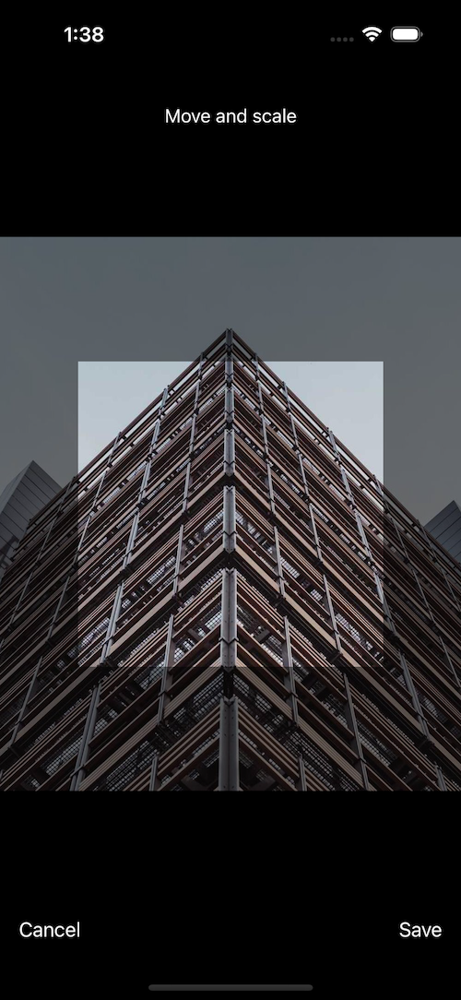
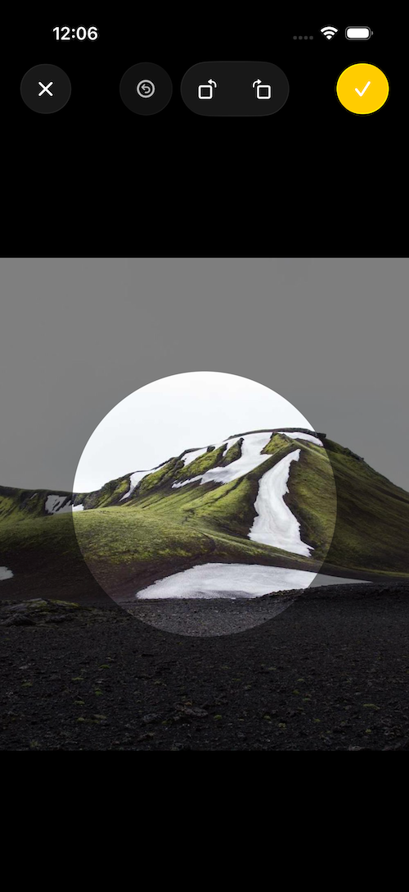

# SwiftyCrop - SwiftUI
[](https://github.com/benedom/SwiftyCrop/actions/workflows/build-swift.yml)


<a href="LICENSE.md">
  
</a>

<p align="center">
  
</p>

<div align="center">

| Circle Mask Shape | Square Mask Shape | Liquid Glass UI |
|:-----------------:|:-----------------:|:---------------:|
|  |  |  |

</div>

## 🔭 Overview
SwiftyCrop allows users to seamlessly crop images within their SwiftUI applications. It provides a user-friendly interface that makes cropping an image as simple as selecting the desired area.

With SwiftyCrop, you can easily adjust the cropping area, maintain aspect ratio, zoom in and out for precise cropping. You can also specify the cropping mask to be a square, circle or rectangle with custom aspect ratio. SwiftyCrop is highly customizable, you can adjust texts, fonts and colors that are used.

The following languages are supported & localized:
- 🇬🇧 English
- 🇩🇪 German
- 🇫🇷 French
- 🇮🇹 Italian
- 🇷🇺 Russian
- 🇪🇸 Spanish
- 🇹🇷 Turkish
- 🇺🇦 Ukrainian
- 🇭🇺 Hungarian
- 🇧🇷 Brazilian Portuguese
- 🇰🇷 Korean
- 🇯🇵 Japanese
- 🇨🇳 Chinese

The localization file can be found in `Sources/SwiftyCrop/Resources`.

## 📕 Contents

- [Requirements](#-requirements)
- [Installation](#-installation)
- [Demo App](#-demo-app)
- [Usage](#-usage)
- [iOS 26 & Liquid Glass](#-ios-26--liquid-glass)
- [Contributors](#-contributors)
- [License](#-license)

## 🧳 Requirements

- iOS 16.0 or later
- Xcode 15.0 or later
- Swift 5.9 or later


## 💻 Installation
There are two ways to use SwiftyCrop in your project:
- using Swift Package Manager
- manual install (embed Xcode Project)

### Swift Package Manager

The [Swift Package Manager](https://swift.org/package-manager/) is a tool for managing the distribution of Swift code. It’s integrated with the Swift build system to automate the process of downloading, compiling, and linking dependencies.

To integrate `SwiftyCrop` into your Xcode project using Xcode 15.0 or later, specify it in `File > Swift Packages > Add Package Dependency...`:

```ogdl
https://github.com/benedom/SwiftyCrop
```

### Manually

If you prefer not to use any of dependency managers, you can integrate `SwiftyCrop` into your project manually. Put `Sources/SwiftyCrop` folder in your Xcode project. Make sure to enable `Copy items if needed` and `Create groups`.

## 📱 Demo App

To get a feeling how `SwiftyCropView` works you can run the demo app (thanks to [@leoz](https://github.com/leoz)).

## 🛠️ Usage

### Quick Start
This example shows how to display `SwiftyCropView` in a full screen cover after an image has been set.
```swift
import SwiftUI
import SwiftyCrop

struct ExampleView: View {
    @State private var showImageCropper: Bool = false
    @State private var selectedImage: UIImage?

    var body: some View {
        VStack {
            /*
            Update `selectedImage` with the image you want to crop,
            e.g. after picking it from the library or downloading it.

            As soon as you have done this, toggle `showImageCropper`.
            
            Below is a sample implementation:
             */

             Button("Crop downloaded image") {
                Task {
                    selectedImage = await downloadExampleImage()
                    showImageCropper.toggle()
                }
             }

        }
        .fullScreenCover(isPresented: $showImageCropper) {
            if let selectedImage = selectedImage {
                SwiftyCropView(
                    imageToCrop: selectedImage,
                    maskShape: .square
                ) { croppedImage in
                    // Do something with the returned, cropped image
                }
            }
        }
    }

    // Example function for downloading an image
    private func downloadExampleImage() async -> UIImage? {
        let urlString = "https://picsum.photos/1000/1200"
        guard let url = URL(string: urlString),
              let (data, _) = try? await URLSession.shared.data(from: url),
              let image = UIImage(data: data)
        else { return nil }

        return image
    }
}
```

:bangbang: NOTE :bangbang:
```
If you want to display `SwiftyCrop` inside a sheet, use `NavigationView` instead of `NavigationStack` in case you want to wrap it.
```

SwiftyCrop supports three different mask shapes for cropping:
- `circle`
- `square`
- `rectangle`

This is only the shape of the mask the user will see when cropping the image. The resulting, cropped image will always be a square by default when using `circle` or `square`. To get a circular cropped image, you can override this using a configuration.

You can also configure `SwiftyCropView` by passing a `SwiftyCropConfiguration`. A configuration has the following properties:

| Property      | Description |
| ----------- | ----------- |
| `maxMagnificationScale` | `CGFloat`: The maximum scale factor that the image can be magnified while cropping. Defaults to `4.0`. |
| `maskRadius` | `CGFloat`: The radius of the mask used for cropping. Defaults to `130`. A good way is to make it dependend on the screens size. |
| `cropImageCircular` | `Bool`: When using the cropping mask `circle`, whether the resulting image should also be masked as circle. Defaults to `false`. |
| `rotateImage` | `Bool`: Whether the image can be rotated when cropping using pinch gestures. Defaults to `false`. |
| `rotateImageWithButtons` | `Bool`: Option to show rotation buttons for rotating. Defaults to `false`. |
| `usesLiquidGlassDesign` | `Bool`: (Beta) apply the all new liquid glass design. Defaults to `false`. This might be changed in the future. |
| `zoomSensitivity` | `CGFloat`: Zoom sensitivity when cropping. Increase to make zoom faster / less sensitive. Defaults to `1.0`. |
| `rectAspectRatio` | `CGFloat`: The aspect ratio to use when a rectangular mask shape is used. Defaults to `4:3`. |
| `texts` | `Texts`: Defines custom texts for the buttons and instructions. Defaults to using localized strings from resources. |
| `fonts` | `Fonts`: Defines custom fonts for the buttons and instructions. Defaults to using system font. |
| `colors` | `Colors`: Defines custom colors for the texts and background. Defaults to white text and black background. |

Create a configuration like this:
```swift
let configuration = SwiftyCropConfiguration(
    maxMagnificationScale: 4.0,
    maskRadius: 130,
    cropImageCircular: false,
    rotateImage: false,
    rotateImageWithButtons: false,
    usesLiquidGlassDesign: false,
    zoomSensitivity: 1.0,
    rectAspectRatio: 4/3,
    texts: SwiftyCropConfiguration.Texts(
        cancelButton: "Cancel",
        interactionInstructions: "Custom instruction text",
        saveButton: "Save"
    ),
    fonts: SwiftyCropConfiguration.Fonts(
        cancelButton: Font.system(size: 12),
        interactionInstructions: Font.system(size: 14),
        saveButton: Font.system(size: 12)
    ),
    colors: SwiftyCropConfiguration.Colors(
        cancelButton: Color.red,
        interactionInstructions: Color.white,
        saveButton: Color.blue,
        background: Color.gray
    )
)
```
and use it like this:
```swift
.fullScreenCover(isPresented: $showImageCropper) {
            if let selectedImage = selectedImage {
                SwiftyCropView(
                    imageToCrop: selectedImage,
                    maskShape: .square,
                    // Use the configuration
                    configuration: configuration
                ) { croppedImage in
                    // Do something with the returned, cropped image
                }
            }
        }
```

## 🪟 iOS 26 & Liquid Glass

To adopt to the new Liquid Glass design Apple introduced with iOS 26, SwiftyCrop supplies a new UI which reflects this design. This will remove text buttons and replace them with icon buttons and much more. Below is the current way it looks. Try it for yourself by enabling it in the configuration!

:bangbang: NOTE :bangbang:
This feature is currently in beta and might change, due to iOS 26 still being in beta and Apple changing design elements. This can only be used on iOS 26 and Xcode 26.

<p align="center">
    
</p>

## 👨‍💻 Contributors

All issue reports, feature requests, pull requests and GitHub stars are welcomed and much appreciated.

Thanks to [@leoz](https://github.com/leoz) for adding the circular crop mode, the demo app and the rotation functionality 🎉

Thanks to [@kevin-hv](https://github.com/kevin-hv) for adding the hungarian localization 🇭🇺

Thanks to [@Festanny](https://github.com/Festanny) for helping with the recangular cropping functionality 🎉

Thanks to [@lipej](https://github.com/lipej) for adding the brazilian portugese localization 🇧🇷🇵🇹

Thanks to [@insub](https://github.com/insub4067) for adding the korean localization 🇰🇷

Thanks to [@yhirano](https://github.com/yhirano) for adding the japanese localization 🇯🇵

Thanks to [@yefimtsev](https://github.com/yefimtsev) for adding the ability to customize fonts and colors 🖼️

Thanks to [@SuperY](https://github.com/SuperY) for adding the chinese localization 🇨🇳

Thanks to [@mosliem](https://github.com/mosliem) for adding the cropping in background thread 🧵

Thanks to [@krayc425](https://github.com/krayc425) for adding visionOS support 🕶️

Thanks to [@KuuttiProductions](https://github.com/KuuttiProductions) for adding the finnish localization 🇫🇮

Thanks to [@puyanlin](https://github.com/puyanlin) for adding the traditional chinese localization 🌐

## 📃 License

`SwiftyCrop` is available under the MIT license. See the [LICENSE](https://github.com/benedom/SwiftyCrop/blob/master/LICENSE.md) file for more info.
